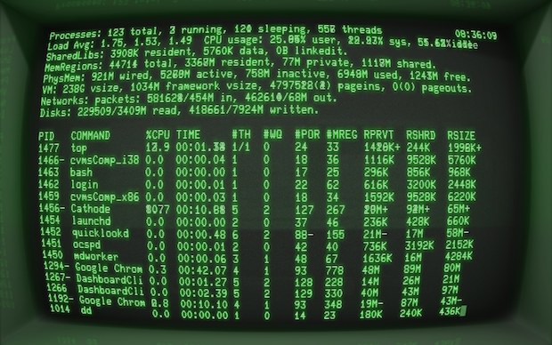

```{r child=c('../setup/setup-options.Rmd')}
```

---

## Agenda and Goals for Today

* Introduce TAs
* Introduction Survey on Canvas
* Review of Course Logistics
* Reminder for Assignment 0 and Quiz
* Linux Command Line Introduction
* Git Background

---

## Introducing our Course TAs!

--

### Aashika Padmanabhan

.pull-left[

]

.pull-right[
* Data Science & Analytics
* Favorite cuisine is Indian, especially Biryani. :)
* Hobbies that I can never give up are Painting & Hiking.
* Fall has become my favorite season after coming to the US.
* Previously worked as Big Data Engineer with Allstate Solutions Private Limited, India.
]

---
## Introducing our Course TAs!

--

### Tianyi Xu

.pull-left[

]

.pull-right[
* Data Science and Analytics
* Cooking/Gaming/Coding/Gym
* Big forehead
]


---

## Introduction Survey

https://georgetown.instructure.com/courses/142215/quizzes/157911

--

### Introduce yourself discussion

Questions to answer in the discussion:

- Preferred programming language(s) for data science

- Coolest data science skill you have learned in the past year

- What domain of data science are you most passionate about

- Describe a personal data science project are you pursuing (or would pursue if you had time!)

- What topic(s) are you most excited about learning in ANLY 502 this term

[Discussion link](https://georgetown.instructure.com/courses/142215/discussion_topics/830209)

---

## Course Logistics

[Canvas site link](https://georgetown.instructure.com/courses/142215)

[Syllabus link](https://georgetown.instructure.com/courses/142215/assignments/syllabus)

[Course calendar link](https://docs.google.com/spreadsheets/u/1/d/e/2PACX-1vQ8k5uBzLOq3op0lBIDDJkMpvpR9UCH9o6cD6qztWdoHPPNY9OxDl3wReMo2oJhO9xJNLs0ZrFnaNJE/pubhtml?gid=0&amp;single=true&amp;widget=true&amp;headers=false)

[GitHub course materials link](https://github.com/gu-anly502/spring-2022)

[GitHub classroom link](https://classroom.github.com/classrooms/34950344-gu-anly502-big-data-and-cloud-computing-spring-2022) - will talk about in Lab

[AWS Academy link](https://awsacademy.instructure.com)

---

## Assignment 0 and Quiz

Tasks:
* Terminal access confirmation

* Watch MIT lectures on fundamental CS content

* Review additional SQL/git material as needed

Logistics:

* **Due date - January 19 11:59pm**

* No submission, but there is a 20-point quiz during lab on the material

[Assignment 0 link](https://georgetown.instructure.com/courses/142215/assignments/685336)

---

## Linux Command Line

### Terminal 


.pull-left[
]

.pull-right[
- Terminal access was **THE ONLY** way to do programming
- No GUIs! No Spyder, Jupyter, RStudio, etc.
- Coding is still more powerful than graphical interfaces for complex jobs
- Coding makes work repeatable
]

---
## Linux Command Line

### BASH

**B**ourne **A**gain **SH**ell

.center[]

- Created in 1989 by Brian Fox
- Brian Fox also built the first online interactive banking software
- BASH is a command processor
- Connection between you and the machine language and hardware

---

## Linux Command Line

### The Prompt

username@hostname:current_directory $

What do we learn from the prompt?

- Who you are - **username**
- The machine where your code is running - **hostname**
- The directory where your code is running - **current_directory**
- The shell type - **$** - this symbol means BASH

---

## Linux Command Line

### Syntax

**`COMMAND -F --FLAG`**
* COMMAND is the program
* Everything after that are arguments
* F is a single letter flag
* FLAG is a single word or words connected by dashes flag. A space breaks things into a new argument.
  + Sometimes single letter and long form flags (e.g. F and FLAG) can refer to the same argument

**`COMMAND -F --FILE file1`**

Here we pass an text argument "file1" into the FILE flag

The **`-h`** flag is usually to get help. You can also run the **`man`** command and pass the name of the program as the argument to get the help page.

Let's try basic commands:

- **`date`** to get the current date
- **`whoami`** to get your user name
- **`echo "Hello World"`** to print to the console

---

## Linux Command Line

### Examining Files

Find out your **P**resent **W**orking **D**irectory **`pwd`**

Examine the contents of files and folders using the **`ls`** command

Make new files from scratch using the **`touch`** command

Globbing - how to select files in a general way

- **`\*`** for wild card any number of characters
- **`\?`** for wild card for a single character
- **`[]`** for one of many character options
- **`!`** for exclusion
- special options **`[:alpha:]`**, **`[:alnum:]`**, **`[:digit:]`**, **`[:lower:]`**, **`[:upper:]`**

[Reference material](https://www.geeksforgeeks.org/file-globbing-linux/)
[Reference material: Shell Lesson 1,2,4,5](https://linuxjourney.com/lesson/the-shell)

---

## Linux Command Line

### Navigating Directories

Knowing where your terminal is executing code ensures you are working with the right inputs and making the right outputs.

Use the command `pwd` to determine the Present Working Directory.

Let's say you need to change to a folder called "git-repo". To change directories you can use a command like `cd git-repo`.


- **`.`** refers to the current directory, such as **`./git-repo`**
- **`..`** can be used to move up one folder, use **`cd ..`**, and can be combined to move up multiple levels **`../../my_folder`**
- **`/`** is the root of the Linux OS, where there are core folders, such as system, users, etc.
- **`~`** is the home directory. Move to folders referenced relative to this path by including it at the start of your path, for example **`~/projects`**.

To view the structure of directories from your present working directory, use the **`tree`** command

[Reference link](https://www.freecodecamp.org/news/linux-command-line-bash-tutorial/)
---

## Linux Command Line

### Interacting with Files

Now that we know how to navigate through directories, we need to learn the commands for interacting with files

- **`mv`** to move files from one location to another
  + Can use file globbing here - ?, *, [], ...
- **`cp`** to copy files instead of moving
  + Can use file globbing here - ?, *, [], ...
- **`mkdir`** to make a directory
- **`rm`** to remove files
- **`rmdir`** to remove directories
- **`rm -rf`** to blast everything! WARNING!!! DO NOT USE UNLESS YOU KNOW WHAT YOU ARE DOING
---

## Linux Command Line

### Using BASH for Data Exploration

Commands:

- **`head FILENAME`** / **`tail FILENAME`** - glimpsing the first / last few rows of data
- **`more FILENAME`** / **`less FILENAME`** - viewing the data with basic up / (up & down) controls
- **`cat FILENAME`** - print entire file contents into terminal
- **`vim FILENAME`** - open (or edit!) the file in vim editor
- **`grep FILENAME`** - search for lines within a file that match a regex expression
- **`wc FILENAME`** - count the number of lines (**`-l`** flag) or number of words (**`-w`** flag)

--

[Reference link](https://elucidata.io/bash-the-data-scientists-magnifying-glass/)
[Reference material: Text Lesson 8,9,15,16](https://linuxjourney.com/lesson/stdout-standard-out-redirect)

---

## Linux Command Line

### Pipes and Arrows

* **`|`** is the most powerful symbol in BASH
* **`>`** sends the stdout to another command (when sent to a file it overwrites anything that was there before)
* **`>>`** appends the stdout to the end of a file (or starts a new file from scratch if one does not exist yet)
* **`<`** sends stdin into the command on the left

To-dos:

* `echo Hello World`
* Counting rows of data with certain attributes

[Reference material: Text Lesson 1,2,3,4,5](https://linuxjourney.com/lesson/stdout-standard-out-redirect)

---

## Linux Command Line

### Alias and User Files

.bashrc is where your shell settings are located

If we wanted a shortcut to find out the number of our running processes, we would write a commmand like **`whoami | xargs ps -u | wc -l`**.

We don't want to write out this full command every time! Let's make an alias.

**`alias alias_name="command_to_run"`**

--

**`alias nproc="whoami | xargs ps -u | wc -l"`**

--

Now we need to put this alias into the .bashrc

**`alias nproc="whoami | xargs ps -u | wc -l" >> ~/.bashrc`**

What happened??

--

**`echo alias nproc="whoami | xargs ps -u | wc -l" >> ~/.bashrc`**

Your commands get saved in **`~/.bash_history`**
---

## Linux Command Line

### Process Managment

Use the command **`ps`** to see your running processes.

--

Use the command **`top`** or even better **`htop`** to see all the running processes on the machine.

Install the program **htop** using the command **`sudo yum install htop -y`**

--

Find the process ID (PID) so you can kill a broken process.

Use the command **`kill [PID NUM]`** to signal the process to terminate. If things get really bad, then use the command **`kill -9 [PID NUM]`**

To kill a command in the terminal window it is running in, try using **Ctrl + C** or **Ctrl + /**

--

Run the **`cat`** command on its own to let it stay open. Now open a new terminal to examine the processes and find the cat process.

[Reference material: Text Lesson 1,2,3,7,9,10](https://linuxjourney.com/lesson/monitor-processes-ps-command)

---

<!-- Git presentation -->

.center[<iframe src="https://docs.google.com/presentation/d/e/2PACX-1vTGfh_WuHjHI2oOuRtHc2cX_Fm4bX5PvIAympT-UFLtyU-3x0RffF7wEgts-t7G_g/embed?start=false&loop=false&delayms=3000" frameborder="0" width="100%" height="740" allowfullscreen="true" mozallowfullscreen="true" webkitallowfullscreen="true"></iframe>]

---

