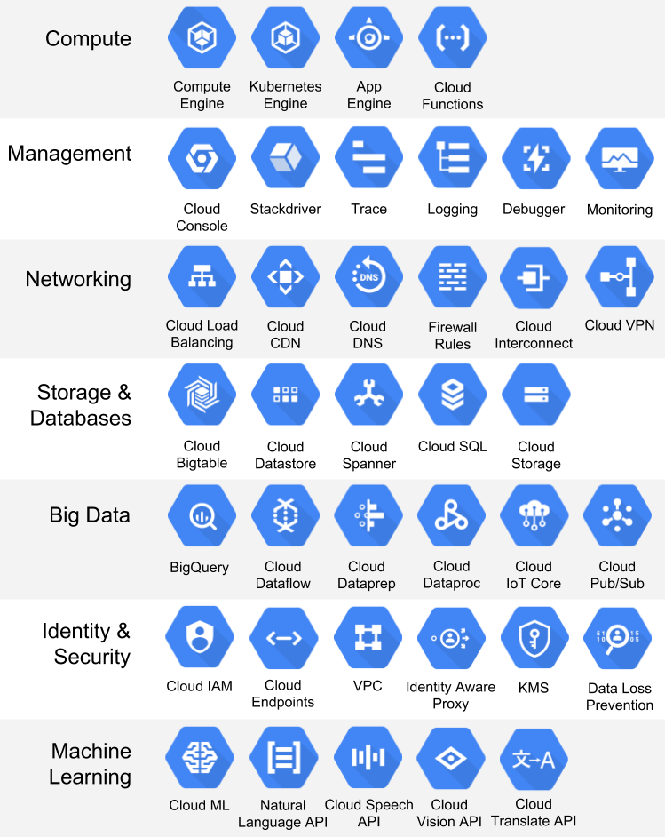
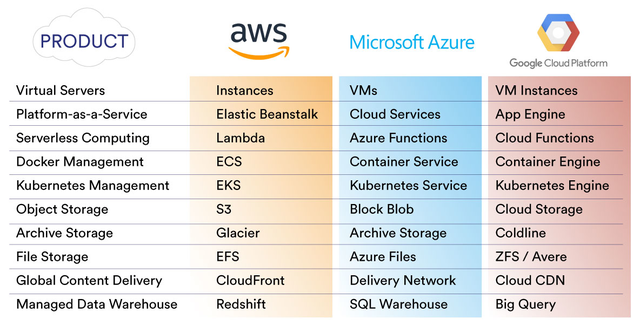
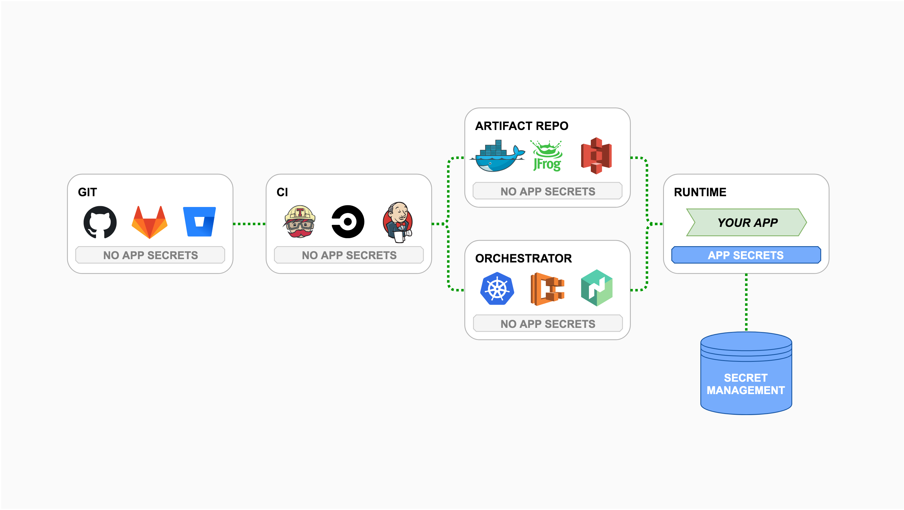
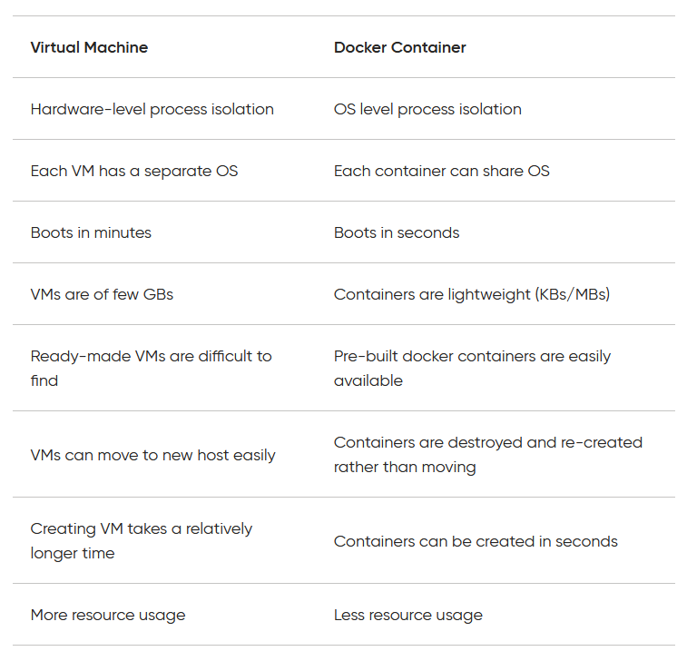

```{r child='../setup/setup-options.Rmd'}
```

```{r packages, echo = FALSE, warning = FALSE, message = FALSE}
library(magrittr, quietly = T, warn.conflicts = F)
library(tibble, quietly = T, warn.conflicts = F)
library(dplyr, quietly = T, warn.conflicts = F)
library(gt, quietly = T, warn.conflicts = F)
library(kableExtra, quietly = T, warn.conflicts = F)
```


.pull-left[

## Looking Back

* Spark DataFrames
* Harnessing data skills at scale
* Building models using big data
* Processing text at scale
* Streaming data at scale

## Upcoming

* AWS/Azure Cloud Computing
* Cloud workflows
* RAPIDS/Dask/Ray/etc.

]

.pull-right[

## Admin

* Fall 2022 TA
* AWS Academy
* Deadlines
* Review of Lab, HW, Project

## Today

* GCP/Azure/Databricks background
* CI/CD pipelines
* Container concepts
* Serverless computing
* AWS Lambda functions

]

---

## TAs for 502 in the Fall

- 502 in the fall will have over 120 students!
- Looking for 4-8 TAs
- Responsibilities: grading, office hours, and course logistics
- Improve your big data skills further!
- My TA experience helped me improve material understanding

---

## AWS Academy

* Credit limit - $100

* Course numbers:
    * Course #1 - 12142
    * Course #2 - 12143
    * Course #3 - 12144
    * Course #4 - 12147 (just sent out!)

STAY CURRENT COURSE UNLESS YOU HAVE RUN OUT OF CREDITS OR >$90 USED!

Note that you will have to repeat several setup steps:

* security group
* EC2 keypair uploading (the AWS part only)
* any data uploading or copying to S3 buckets (bucket creation as necessary)
* EMR configuration

---

## AWS Academy Issue!

AWS' investigation indicates that any Learner Lab that was accessed by a student between March 27 at 2:40 PM ET and March 28 at 3:40 PM ET was reset for that student, resulting in a loss of student work in the Learner Lab.

* How do we deal with this?

--

### ALWAYS PUSH OFTEN!
### ALWAYS SAVE IMPORTANT INTERMEDIATE DATA

---

## Deadlines

* Project EDA Discussion Post due 4/4 (+24 hours) **PAST DUE**
* Lab 11 Deliverable due 4/6 (+24 hours) - https://georgetown.instructure.com/courses/142215/modules/items/2662179
* Project EDA Response Posts due 4/10 (+24 hours) - https://georgetown.instructure.com/courses/142215/discussion_topics/866838
* Lab 12 Deliverable due 4/13 (+24 hours) - https://georgetown.instructure.com/courses/142215/modules/items/2662181
* Project NLP Assignment due 4/15 (+24 hours) - https://georgetown.instructure.com/courses/142215/assignments/722142


---

## Questions on Lab 11?

* https://github.com/gu-anly502/lab-spark-structuredstreaming

---

## Review of Lab 10

* https://github.com/bigdatateaching/lab-spark-nlp

Live walkthrough with solution notebook!

---

## Project EDA Assignment Review

Major points:

- You must analyze all of your data! Taking a smaller slice of data is good for testing, but that is not what you present at the end of your analysis
- The data is not perfect!! Missing original posts, not all the topics you want! **This happens all the time**
- Very few people saved the final dataset that they made in their assignment. This means you now have to re-process all your data! That means more computation!
- Issues with converting unix timestamp into datetime format. What options do we have to convert the data type?

---

## Project NLP Assignment Overview

* https://github.com/gu-anly502/project-nlp-assignment-AndersonMonken

* Use the [discussion board](https://georgetown.instructure.com/courses/142215/modules/items/2542882) for Module 13 to ask questions on the project!

---

## Project Check-In

- What are your major blockers?
- Technical problems?
- Are there skills I can review to help your work?
- Do you need to brainstorm next steps of your project?
- Issues with output of analysis?

---

class: inverse, middle, center

# GCP
---

## Services

.center[

]

---

## BigQuery


* Serverless data warehouse
* No active hardware you have to manage
* Data can be pulled from S3
* Native SQL query architecture

---

## BigQuery Back End

.pull-left[ ]

.pull-right[

* Dremel - execution engine breaking query into pieces with workers and aggregators. - **How does this compare to a Spark job?**
* Jupiter - 1 Petabit/sec networking for data distribution within the cluster - **How does data move to compute in AWS?**
* Colossus distributed data - recovery, replication, scale to dozens of Petabytes
* Borg - large-scale resilient cluster that runs in the background with virtual layer

Read the working paper on [Dremel](http://static.googleusercontent.com/media/research.google.com/en//pubs/archive/36632.pdf)

]

---

## BigQuery Example

https://cloud.google.com/blog/products/bigquery/anatomy-of-a-bigquery-query

---

class: inverse, middle, center

# Azure
---

## Service Comparison



---

## Azure Data Science Machines

https://docs.microsoft.com/en-us/azure/machine-learning/data-science-virtual-machine/overview

---

## Azure pros and cons

#### Pros

* Good for hybrid cloud environment
* Strong connections to existing Microsoft products


#### Cons

* Less flexible for Linux offerings
* Lower market penetration, so smaller user community

---

class: inverse, middle, center


---

## Databricks Details


* Optimizes Spark optimizations
* Built on top of Azure, but can be used with GCP or AWS
* Improved Jupyter notebook experience
* Easy setup of dashboards based on exploratory queries

---

## Databricks Guide

https://docs.databricks.com/getting-started/quick-start.html

What open source tool looks somewhat like this?

---

class: inverse, middle, center

# CI/CD Pipelines
---

## Continuous integration

* Merging your code into a central repository
* Running automated tests to ensure core functionality after all changes
* Releases are streamlined for both features and bug fixes


.center[

]


---

## Continuous Delivery / Deployment

#### Delivery
* How the code is delivered to users
* App changes incremental with A/B testing
* Release team to decide how code makes it to users

#### Deployment

* All changes to production are pushed automatically
* Human intervention only if there is a failed test

Read about differences between CI/CD/CD [here](https://www.indellient.com/blog/whats-the-difference-between-continuous-integration-continuous-delivery-and-continuous-deployment/#CI-v-CD).

---

## Careful about secrets in your code!



---

class: inverse, middle, center

# Container Concepts
---


* Package and run applications in isolated environment
* Pass your application to others to execute
* Great for production work, not as much for developmental work
* Docker like a tiny virtual machine (VM) without any of the OS

[docker basics](https://docs.docker.com/get-started/overview/)

---

## Docker vs. VM

.center[

]

---

## Docker for Python jobs

Basic needs:
- Dockerfile that sets up environment
- Application code to execute
- List of packages to install

[Walkthrough](https://docs.docker.com/language/python/build-images/)

---

## Steps for Docker

1. Write your Dockerfile

```
FROM python:3.8-slim-buster

WORKDIR /app

COPY requirements.txt requirements.txt
RUN pip3 install -r requirements.txt

COPY . .

CMD [ "python3", "-m" , "flask", "run", "--host=0.0.0.0"]

```

---

## Steps for Docker

2. Build the docker image using a tag and version number `docker build ./ -t docker-tag-name:1.0`. Read about docker building options [here](https://docs.docker.com/engine/reference/commandline/build/).

3. Check your docker images in your local file system using `docker images`

4. Test your docker image using `docker run -it docker-tag-name`. Read about the flags [here](https://docs.docker.com/engine/reference/run/). The `i` is to keep STDIN open, the `t` is for pseudo-TTY mode (shell).

5. Deploy your docker image somewhere!

---

## Docker can be used with EMR!

[AWS examples](https://docs.aws.amazon.com/emr/latest/ReleaseGuide/emr-spark-docker.html)

---

## Comparing performance of Docker images


[Article discussing performance considerations](https://dev.to/pmutua/the-best-docker-base-image-for-your-python-application-3o83)

---

class: inverse, middle, center

# Serverless Computing
---


---

## Serverless computing

* AWS Serverless Application Model - [site]( https://aws.amazon.com/serverless/sam/)

* Serverless NPM framework (cloud agnostic) - [site](https://www.serverless.com/)

---
class: inverse, middle, center

# AWS Lambda Functions
---

## Lambda Details


* Micro executions without dealing with any hardware "serverless" computation
* Can run many copies of code depending on number of requests or files
* Pricing based on RAM and time used - 
https://aws.amazon.com/lambda/pricing/
* Max execution time - 15 minutes
* Max RAM - 10 GB

---

## Lambda coding choices

Levels of Lambda complexity:

1. Basic code
2. Zip archive
3. Docker Containers

---

## Lambda basic code demo

The "hello world" example and then numbers with an endpoint
* https://frankcorso.dev/aws-lambda-function-endpoint-api-gateway.html

---

## Lambda can be set on a schedule

* Similar to Linux Crontab or Windows Task Scheduler

[example of schedule trigger](https://docs.aws.amazon.com/lambda/latest/dg/services-cloudwatchevents-expressions.html)

* Site for translating crontab symbols to next execution: https://crontab.guru/
* Site for generating crontab syntax from dropdown options: https://crontab-generator.org/

---

## Using a zip archive for Lambda

[AWS example of zip archive](https://docs.aws.amazon.com/lambda/latest/dg/python-package.html)

---

class: inverse, middle, center


---

## Docker with Lambda

[AWS example](https://docs.aws.amazon.com/lambda/latest/dg/python-image.html#python-image-base)
[Walkthrough post](https://www.philschmid.de/aws-lambda-with-custom-docker-image)

---

## Interactivity with Lambda?


[If you "hack" it!](https://www.keithrozario.com/2019/08/interactive-shell-on-a-lambda-function.html)

---

## Connecting multiple Lambdas together

[Connecting multiple lambda using AWS Step Functions](https://medium.com/zenofai/create-an-etl-solution-using-aws-step-functions-lambda-and-glue-302623bc2fea)

---

## Performance optimization

#### warm start vs cold start

[Discussion post on AWS](https://aws.amazon.com/blogs/compute/operating-lambda-performance-optimization-part-1/)


## Extra links

https://www.tatvasoft.com/blog/aws-lambda-vs-azure-functions/

serverless web scraper with python and lambda - up to date simple example
https://towardsdatascience.com/serverless-covid-19-data-scraper-with-python-and-aws-lambda-d6789a551b78

